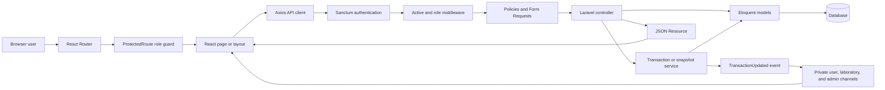
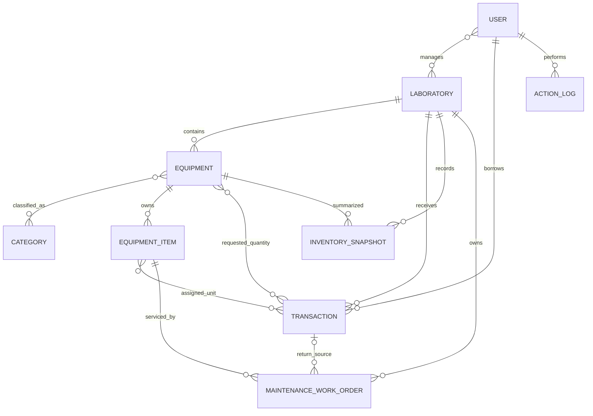
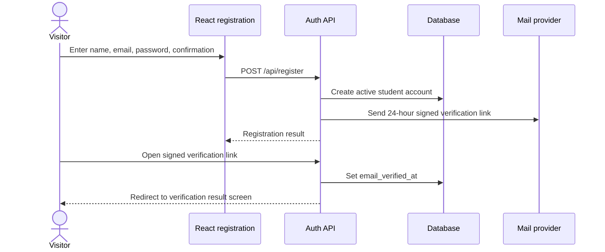
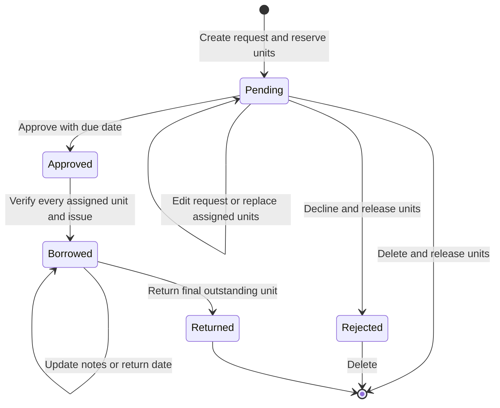
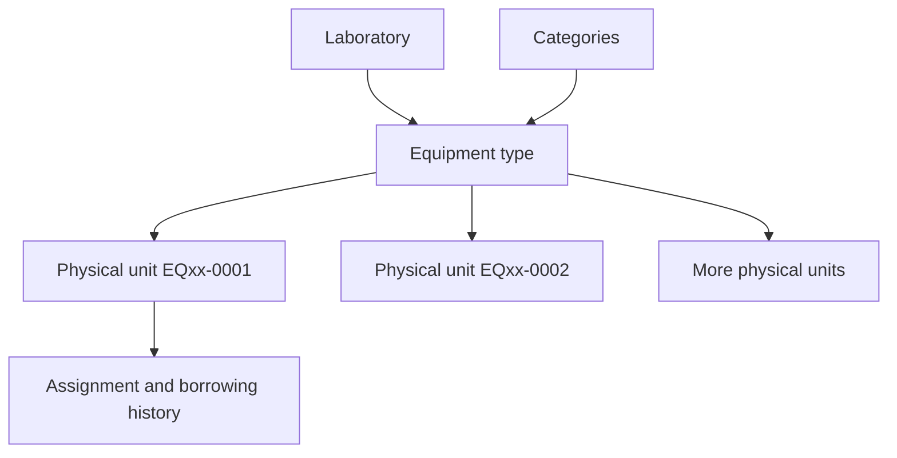
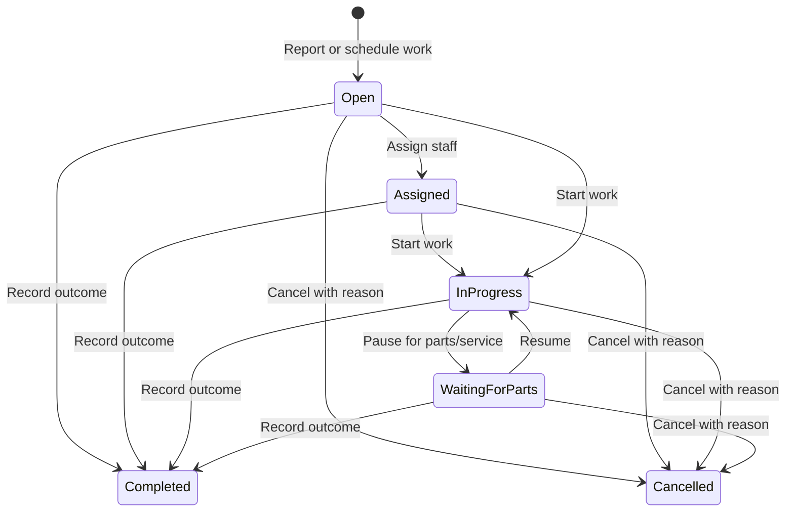
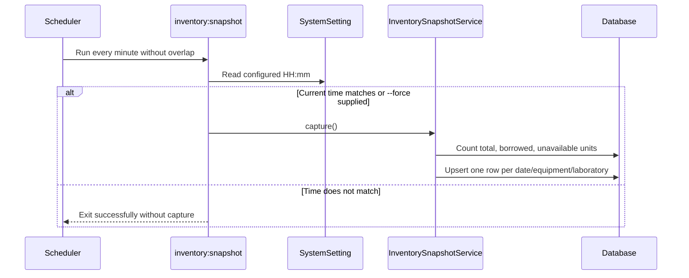

# QHS Equipment Inventory — System Workflow and Function Reference

This document explains the current QHS Equipment Inventory application from the user, operator, and developer perspectives. It is derived from the Laravel API, React/TypeScript client, policies, validation requests, services, routes, models, and scheduled commands in this repository.

## 1. System purpose

QHS Equipment Inventory is a role-based laboratory equipment management and borrowing system for Quirino High School. It provides:

- A student portal for finding available laboratory equipment, building a cart, submitting borrowing requests, and following request decisions.
- A custodian workspace for maintaining equipment and physical units in assigned laboratories and processing their borrowing requests.
- An administrator workspace for managing users, laboratories, categories, equipment, transactions, reports, inventory snapshots, and audit logs.
- Physical-unit tracking through unique unit identifiers and QR-ready unit history pages.
- Atomic inventory reservation so the same physical unit cannot be allocated to two requests at the same time.
- Maintenance, repair, calibration, cleaning, inspection, and validation work orders tied to individual units.
- Private real-time transaction notifications with periodic API polling as a fallback.

The application is a single deployment:

- Laravel serves the JSON API, authorization, data model, mail, scheduled jobs, health endpoint, and production frontend shell.
- React 18 and TypeScript provide the browser interface.
- Vite compiles the browser application into `public/app`.
- Encrypted HttpOnly Sanctum session cookies authenticate the first-party browser and private broadcast requests; legacy bearer tokens remain accepted for compatibility but are not issued by browser login.
- Reverb/Echo provides optional private transaction events.

## 2. Roles and permissions

| Capability | Student (`user`) | Custodian | Administrator |
|---|---:|---:|---:|
| Register and verify own account | Yes | No self-service role creation | No self-service role creation |
| View own dashboard, profile, and request history | Yes | Profile through authenticated account data | Profile through authenticated account data |
| View laboratories | Active laboratories | Assigned laboratories | All laboratories |
| View equipment | Active equipment in active laboratories | Equipment in assigned laboratories | All equipment |
| Submit a borrowing request | For self only | For an active student | For an active student |
| Edit/delete a pending or rejected own request | Yes | Requests in assigned laboratories | Yes |
| Accept, reject, return, or reassign units | No | Assigned laboratories only | Yes |
| Create/update equipment and units | No | Assigned laboratories only | Yes |
| Delete/archive equipment | No | No | Yes |
| Manage laboratories and custodian assignment | No | No | Yes |
| View active students | No | Yes, for request creation | Yes |
| Create/update/delete users and roles | No | No | Yes |
| Manage categories | No | No | Yes |
| View transaction reports | No | Assigned laboratories | All laboratories |
| Create and process maintenance work orders | No | Assigned laboratories | All laboratories |
| View/export inventory snapshots | No | Assigned laboratories | All laboratories |
| Configure or trigger snapshots | No | No | Yes |
| View audit logs and dashboard analytics | No | No | Yes |

Every protected API request must pass all of these checks:

1. A valid first-party Sanctum session (or compatible API token) is present.
2. Token abilities are checked for compatible API clients; first-party sessions receive Sanctum's transient abilities.
3. The account remains active.
4. The route role middleware allows the account's role.
5. Where applicable, a policy confirms access to the requested record or laboratory.

The client-side role guard improves navigation, but backend middleware and policies are the actual security boundary.

## 3. Architecture and request flow



### Main code ownership

| Layer | Location | Responsibility |
|---|---|---|
| Browser routes | `QHS/src/router.tsx` | Maps URLs to guest, student, custodian, and admin screens. |
| Session state | `QHS/src/Context/ContextProvider.tsx` | Restores, verifies, and expires in-memory browser authentication state backed by an HttpOnly server session. |
| API client | `QHS/src/axiosClient.ts` | Sends credentials, obtains/refreshes CSRF cookies, sets timeouts, normalizes base URLs, and handles `401`/`419` responses. |
| Controllers | `app/Http/Controllers` | Coordinates validation, authorization, services, resources, and HTTP responses. |
| Validation | `app/Http/Requests` | Defines request fields, limits, file types, and request-level authorization. |
| Authorization | `app/Policies` and middleware | Enforces roles, record ownership, and custodian laboratory scope. |
| Business rules | `app/Services` | Performs atomic transaction and snapshot workflows. |
| Persistence | `app/Models` | Defines records, casts, relationships, scopes, and date behavior. |
| API presentation | `app/Http/Resources` | Produces stable JSON response shapes and computed summaries. |
| Realtime | `app/Events/TransactionUpdated.php`, `routes/channels.php`, `QHS/src/echo.ts` | Publishes and receives private transaction updates. |
| Audit trail | `app/Traits/ActionLogger.php`, `ActionLogController` | Records important mutations and renders readable activity. |

## 4. Domain model



### Records

- **User** — account, contact data, role, activation state, verification state, password-reset state, and avatar.
- **Laboratory** — name, location, description, activation state, gallery image, and assigned custodian relationship.
- **Category** — reusable classification attached to many equipment records.
- **Equipment** — an equipment type or model in one laboratory, with categories, description, image, and active/archive state.
- **Equipment item** — one physical unit of equipment, with a unique `unit_id`, condition, and reservation/borrow flag.
- **Transaction** — one borrowing request for a student and laboratory, including dates, notes, requested quantities, assigned physical units, state, decision details, and handler names.
- **Maintenance work order** — an incident, repair, preventive-maintenance, calibration, cleaning, inspection, or validation job for one physical unit, including ownership, schedule, cost, result, and recurrence data.
- **Inventory snapshot** — daily totals for one equipment record in one laboratory: total, borrowed, and available.
- **System setting** — key/value configuration, currently including the daily snapshot time.
- **Action log** — who performed an important mutation, the request method/route, request origin metadata, action name, and related record metadata.

### Controlled values

**User roles:** `admin`, `custodian`, `user`.

**Stored transaction statuses:** `pending`, `approved`, `borrowed`, `returned`, `rejected`. `overdue` and `partially_returned` are derived lifecycle stages rather than mutable database statuses.

**Equipment conditions:** `New`, `Good`, `Fair`, `Poor`, `Damaged`, `Missing`, `Under Repair`.

**Maintenance types:** `incident`, `repair`, `preventive_maintenance`, `calibration`, `cleaning`, `safety_inspection`, `validation`.

**Maintenance statuses:** `open`, `assigned`, `in_progress`, `waiting_for_parts`, `completed`, `cancelled`. Active work is any status before `completed` or `cancelled`.

**Maintenance priorities:** `low`, `normal`, `high`, `critical`.

`New`, `Good`, `Fair`, and `Poor` are usable. `Damaged`, `Missing`, and `Under Repair` are unavailable and excluded from automatic reservation and availability totals.

## 5. End-to-end workflows

### 5.1 Registration and email verification



Rules:

- Public registration always creates the `user` role; a visitor cannot self-select admin or custodian.
- Email must be unique.
- Password must be confirmed and contain at least eight characters, letters, and numbers.
- The verification URL is signed and expires after 24 hours.
- Resend responses do not reveal whether an email exists.
- An unverified or inactive account cannot sign in.

### 5.2 Sign-in, session restoration, and logout

1. The login form sends email and password to `POST /api/login`.
2. Laravel verifies the password, active state, and email verification state.
3. Legacy personal tokens are revoked, the session ID is regenerated, and Laravel authenticates the encrypted server session.
4. The browser keeps only non-secret authentication state in memory; the session credential remains in a Secure, HttpOnly cookie.
5. The user is redirected to `/admin`, `/custodian`, or `/` according to role.
6. On page reload, `ContextProvider` calls `GET /api/user` to restore the server session.
7. Any API `401` clears local authentication and sends the browser back through the guest flow.
8. Logout invalidates the server session, rotates the CSRF token, clears in-memory state, and redirects to `/auth`.

### 5.3 Password recovery

1. A visitor submits an email to `POST /api/forgot-password`.
2. If the account exists, Laravel stores only a SHA-256 hash of a random reset token with a one-hour expiry and emails the plain token in the reset URL.
3. The public response is intentionally identical for existing and unknown email addresses.
4. The reset page submits token, email, new password, and confirmation to `POST /api/reset-password`.
5. The server compares the token hash, checks expiry, changes the password, clears reset fields, and revokes all existing access tokens.

### 5.4 Student equipment discovery and cart

1. The equipment directory loads visible equipment, visible laboratories, and individual units.
2. Availability is calculated from physical units that are not borrowed/reserved and do not have an unavailable condition.
3. The student can filter by laboratory, search by name/description/category, open equipment details, and select a quantity.
4. Cart state is stored in local storage and shared with the student layout through a `cartUpdated` browser event.
5. Quantities cannot exceed the current available count.
6. The cart groups equipment by laboratory because each transaction belongs to exactly one laboratory.
7. A student must have a profile address before submitting.

Favorites shown in the equipment directory are currently in-memory UI state only; they are not persisted to the server.

### 5.5 Borrowing request lifecycle



Important implementation detail: the system reserves specific physical units while the request is `pending` or `approved`. The selected items receive `isBorrowed = true` to prevent overbooking. Approval means ready for pickup, while the QR/checklist handover changes the request to `borrowed`. Each partial return releases only that physical unit; rejection or pending-request replacement releases all applicable reservations.

#### Student submission

- The browser creates one request per laboratory represented in the cart.
- The server ignores borrower identity fields supplied by a student and derives identity from the authenticated account.
- Every equipment line must belong to the selected laboratory and must be active for student self-service.
- The server locks candidate records, takes the requested number of available units, marks them reserved, and attaches them to the transaction inside one database transaction.
- If any line lacks enough available units, the entire request is rolled back.

#### Staff-created request

- An admin or custodian selects an active student.
- A custodian may create a request only for an assigned laboratory.
- The same atomic availability and reservation rules apply.

#### Pending edit

- The service locks the transaction.
- Existing assigned units are released and detached.
- The request details and requested quantities are updated.
- New units are reserved atomically.
- A status change that occurred concurrently causes validation to fail instead of overwriting the newer state.

#### Unit reassignment

- Admins and the laboratory's custodian may replace assigned units while a request is pending.
- Assignment groups must exactly match the equipment types in the request.
- Each group must contain exactly the requested quantity.
- Every selected unit must belong to that equipment, exist, be usable, and be available.

#### Approval, issue, rejection, and return

- Only an admin or custodian assigned to the request's laboratory can process it.
- Only `pending` can become `approved` or `rejected`; approval requires an existing or submitted due date.
- Issue requires the exact assigned unit set, accepts raw IDs or existing item-history QR URLs, records issue condition snapshots, and changes `approved` to `borrowed`.
- Any non-empty subset of outstanding issued units can be returned. Each receives a return condition, note, handler snapshot, actor ID, and timestamp.
- `Damaged`, `Missing`, and `Under Repair` returns require notes and become unavailable immediately.
- The transaction stays `borrowed` until its last issued unit is returned, then becomes `returned`.
- Handler IDs are nullable foreign keys; handler names remain immutable snapshots if an account is deleted later.
- Rejection optionally stores a reason and releases units.
- Each processed return releases that unit immediately.
- Overdue is derived from the due date and issued, outstanding units.
- Repeating an already-completed transition fails validation.

#### Deletion

- Only `pending` and `rejected` transactions can be deleted.
- Borrowed and returned history is retained.
- Deleting a pending request releases and detaches reserved units first.

### 5.6 Equipment catalog and physical units



- Admins and custodians can create and update equipment; custodians are limited to assigned laboratories.
- An equipment record contains descriptive/catalog data. Quantity is derived from child physical units, not stored directly on the equipment row.
- New units receive generated IDs in the form `EQ{equipment id}-{sequence}`, for example `EQ01-0001`.
- Unit condition can be changed only while the unit is not borrowed/reserved.
- A unit cannot be deleted after it has borrowing history or while borrowed/reserved.
- Equipment cannot be deleted after it has units or transaction history; it should be archived instead.
- Equipment with borrowed/reserved units cannot be archived.
- Admins and custodians can print individual or bulk QR labels that lead to authorized unit history.
- CSV import accepts at most 500 rows, 5,000 created units, and 2 MB per request. It inserts unit records in bounded batches inside one outer database transaction, is limited to two requests per minute, and forces custodians into their assigned laboratory.

### 5.7 Maintenance, calibration, and inspection



- Admins manage work orders system-wide; custodians are restricted to units and work orders in every laboratory assigned to them.
- Creating a work order locks the unit, rejects borrowed/reserved units and duplicate active work, snapshots its prior condition, and marks it `Under Repair` and unavailable.
- A work order can record title, description, type, priority, assignee, schedule, due date, service provider, estimated cost, and recurrence interval.
- Starting work records the first start time. Active records can be reassigned or moved among open, assigned, in-progress, and waiting-for-parts states.
- Completion requires notes and a resulting unit condition, optionally records actual cost/provider, restores availability only when the result is usable, and calculates the next due date for recurring service.
- Cancellation requires a reason and restores the unit's snapshotted condition when it is safe to do so.
- Returning a unit as `Damaged` or `Under Repair` automatically opens a high-priority repair; returning it as `Missing` opens a critical incident. The originating borrow transaction remains linked for traceability.
- Unit history shows the maintenance timeline beside custody history. Completed or cancelled work remains immutable audit history.
- Dashboards expose open, overdue, and due-soon maintenance queues.

### 5.8 Laboratory management

- Students see only active laboratories.
- Custodians see only laboratories assigned through the `custodian_laboratory` pivot table.
- Admins can create/update laboratories, change the active state, upload the gallery image, and assign a user whose role is `custodian`.
- A laboratory with equipment or transaction history cannot be deleted and should be archived instead.
- The laboratory information screen allows administrators to review and change the assigned custodian.

### 5.9 User administration

- Admins can create, view, update, activate/deactivate, change roles, reset passwords, upload avatars, and delete accounts.
- Accounts created by an admin are email-verified immediately.
- Deactivation revokes the target user's tokens.
- The system prevents removing, demoting, or deactivating the final active administrator.
- An administrator cannot delete the account currently being used.
- Custodians can list active student accounts only, which supports staff-created borrowing requests without exposing account administration.

### 5.10 Dashboards and reports

The administrator dashboard displays real data only:

- Total, active, and recently created users.
- Laboratory inventory totals and available counts.
- Equipment-unit condition distribution.
- Pending requests, awaiting-pickup/overdue/partial-return queues, and open/overdue/due-soon maintenance totals.
- Recent audit actions.
- Date-range and laboratory filters for dashboard charts.

The custodian dashboard summarizes assigned-laboratory equipment, available/borrowed units, request queues, maintenance queues, and utilization.

Transaction reports calculate daily, monthly, and annual counts from transactions visible to the signed-in role. They can be printed or exported to CSV.

Inventory reports combine current physical-unit counts and saved daily snapshots. Visible report data can be printed or exported.

### 5.11 Daily inventory snapshots



- Admins can read/update the scheduled time and trigger a snapshot immediately.
- Admins and custodians can query a maximum date range of 366 days.
- Custodian queries and exports are restricted to assigned laboratories.
- CSV export streams rows and prefixes formula-like cell values to prevent spreadsheet formula injection.

### 5.12 Audit logging

Important category, equipment, item, laboratory, user, transaction, and maintenance mutations call `ActionLogger::logAction`.

The logger stores:

- Authenticated user ID.
- Action identifier.
- HTTP method and route.
- Request IP and truncated user agent.
- Related IDs and, when available, friendly record names.

The admin log screen filters by user, action, and date range, paginates results, formats readable messages, and supports printing.

Audit logging is deliberately non-blocking: if the log write fails, the primary business operation remains successful and a server warning is emitted.

### 5.13 Realtime updates

Every created or changed transaction is serialized and broadcast as `transaction.updated` to:

- `transactions.admin` for administrators.
- `transactions.lab.{laboratory_id}` for the assigned custodian(s).
- `transactions.user.{borrower_id}` for the student.

Channel authorization prevents users from subscribing outside their role or laboratory. The browser dispatches a local `transactionUpdated` event after receiving an Echo event. Dashboards, notifications, and transaction lists refresh. Ten-second polling keeps the interface functional when Reverb is disabled or disconnected.

## 6. Browser page reference

### Guest pages

| Route | Screen | Function |
|---|---|---|
| `/auth` | Login | Validates credentials, establishes the server session, saves only in-memory account state, and follows the safe `next` route or role destination. |
| `/auth/register` | Register | Creates a student account and sends the visitor to the email-verification guidance flow. |
| `/auth/verify-email` and `/verify-email` | Verify email | Displays verification results and can request another verification email. |
| `/forgot-password` | Forgot password | Requests a password-reset email without revealing account existence. |
| `/reset-password` | Reset password | Reads token/email query parameters and submits a confirmed replacement password. |

### Student pages

| Route | Screen | Function |
|---|---|---|
| `/` | Student home | Shows pending, currently borrowed, and returned request totals plus quick actions and borrowing guidance. |
| `/laboratories` | Equipment directory | Searches and filters active equipment, displays live unit availability, opens details, and adds quantities to the cart. |
| `/borrow-history` | My requests | Groups pending, approved/ready-for-pickup, borrowed/partial/overdue, returned, and rejected requests with custody progress and condition findings. |
| `/profile` | Profile | Updates name, address, avatar, and password with inline success/error feedback. |
| `/about` | About | Explains the service and the responsibilities of borrowers and staff. |

The student layout also provides responsive navigation, a persistent cart, request submission, request notifications, a profile menu, and logout.

### Administrator pages

| Route | Screen | Function |
|---|---|---|
| `/admin` | Overview | Shows system summary metrics, user growth, laboratory inventory, condition charts, recent transactions, and recent audit activity. |
| `/admin/users` | Users | Searches, sorts, paginates, creates, edits, activates/deactivates, and deletes accounts. |
| `/admin/lab` | Laboratories | Lists laboratories and opens create, edit, details, and delete/archive workflows. |
| `/admin/lab/new` | New laboratory | Creates a laboratory, assigns a custodian, sets active state, and uploads a gallery image. |
| `/admin/lab/:id` | Edit laboratory | Loads and updates an existing laboratory. |
| `/admin/lab/:name/:id` | Laboratory information | Shows laboratory details and updates its assigned custodian. |
| `/admin/equipment` | Equipment | Searches, filters, changes view/pagination, imports/exports CSV, archives, and deletes eligible equipment. |
| `/admin/equipment/new` | New equipment | Creates catalog data, category links, laboratory assignment, active state, and image. |
| `/admin/equipment/:id` | Edit equipment | Updates an equipment record and its category/laboratory/image data. |
| `/admin/equipment/info/:id` | Equipment details | Lists physical units, condition/availability, category links, QR printing, and unit actions. |
| `/admin/equipment/info/:equipmentID/add-item` | Add unit | Creates a physical unit with an automatically generated ID. |
| `/admin/equipment/info/:equipmentID/edit-item/:id` | Edit unit | Changes the condition of an eligible physical unit. |
| `/admin/transactions` | Transactions | Creates/edits requests, accepts, rejects, returns, inspects assigned units, and replaces pending assignments. |
| `/admin/maintenance` | Maintenance | Searches and filters work orders; opens, assigns, schedules, starts, completes, or cancels unit maintenance. |
| `/admin/transaction-reports` | Transaction reports | Builds daily/monthly/annual summaries and exports or prints them. |
| `/admin/inventory` | Inventory reports | Shows live counts and snapshot-based reports with print/export actions. |
| `/admin/category` | Categories | Searches, paginates, creates, edits, and deletes categories. |
| `/admin/logs` | Activity logs | Filters, paginates, formats, and prints audit records. |

### Custodian pages

| Route | Screen | Function |
|---|---|---|
| `/custodian` | Overview | Shows aggregate equipment and transaction summaries for every assigned laboratory. |
| `/custodian/equipment` and child routes | Equipment and units | Uses the same equipment/unit screens but the API restricts data and writes to assigned laboratories. |
| `/custodian/transactions` | Transactions | Lists and processes requests for assigned laboratories. |
| `/custodian/maintenance` | Maintenance | Processes maintenance work for units in every assigned laboratory. |
| `/custodian/transaction-reports` | Transaction reports | Reports only on visible laboratory transactions. |
| `/custodian/inventory-snapshots` | Daily snapshots | Queries, prints, and exports assigned-laboratory snapshots. |

If a custodian has no assigned laboratory, laboratory-dependent navigation is disabled.

### Shared status page

| Route | Screen | Function |
|---|---|---|
| `/item-history/:unitID` | Unit history | Admin/custodian-only view of the selected unit's custody and maintenance history. |
| `/not-authorized` | Access denied | Explains the authorization failure and provides a dashboard return path. |
| `*` | Not found | Handles unknown browser routes. |

## 7. API endpoint reference

All paths below are relative to `/api`.

### Public and authentication endpoints

| Method | Path | Access | Purpose |
|---|---|---|---|
| `POST` | `/register` | Public, registration-throttled | Create a student and send verification mail. |
| `POST` | `/login` | Public, account-and-network throttled | Authenticate and establish a regenerated Sanctum session. |
| `POST` | `/forgot-password` | Public, recovery-throttled | Create and email a one-hour reset token when the account exists. |
| `POST` | `/reset-password` | Public, reset-attempt-throttled | Validate reset token and replace the password without sharing the email-request quota. |
| `POST` | `/email/resend` | Public, resend-throttled | Resend a verification link without account disclosure. |
| `GET` | `/email/verify/{id}` | Signed, verification-throttled | Verify an email and redirect to the frontend result page. |

### Authenticated shared endpoints

| Method | Path | Purpose |
|---|---|---|
| `POST` | `/logout` | Invalidate the current session or revoke a compatible API token. |
| `GET` | `/user` | Return the authenticated user for session restoration. |
| `GET` | `/email/verification-status` | Return current verification state. |
| `POST` | `/profile/update` | Update name, address, and optional avatar. |
| `POST` | `/profile/password` | Verify the current password and change it. |
| `GET` | `/laboratories` | List laboratories visible to the role. |
| `GET` | `/laboratories/{laboratory}` | Show an authorized laboratory. |
| `GET` | `/equipment-data` | Return visible equipment, laboratories, and categories in one response. |
| `GET` | `/equipment` | List visible equipment, optionally filtered by laboratory. |
| `GET` | `/equipment/{equipment}` | Show authorized equipment and its units/categories. |
| `GET` | `/categories` | List categories. |
| `GET` | `/categories/{category}` | Show one category. |
| `GET` | `/item` | List physical units visible to the role. |
| `GET` | `/equipment/{equipment}/available-items` | List usable, unreserved units for authorized equipment. |
| `GET` | `/transactions` | Paginate transactions scoped to borrower, laboratory, or all records. |
| `POST` | `/transactions` | Create and atomically reserve a borrowing request. |
| `GET` | `/transactions/{transaction}` | Show an authorized request. |
| `PUT/PATCH` | `/transactions/{transaction}` | Edit a pending request or allowed processed fields. |
| `DELETE` | `/transactions/{transaction}` | Delete an authorized pending/rejected request. |

### Administrator and custodian endpoints

| Method | Path | Purpose |
|---|---|---|
| `GET` | `/users` | Admin: users; custodian: active students. |
| `POST` | `/equipment` | Create equipment in an authorized laboratory. |
| `PUT/PATCH/POST` | `/equipment/{equipment}` | Update authorized equipment; `POST` supports multipart form updates. |
| `POST` | `/equipment/import` | Validate and import up to 500 equipment rows and 5,000 total units within the request/rate caps. |
| `POST` | `/item` | Create a physical unit for authorized equipment. |
| `GET` | `/item/{item}` | Show a manageable physical unit. |
| `PUT/PATCH` | `/item/{item}` | Update an eligible unit's condition. |
| `GET` | `/item/{unitId}/history` | Return current unit data and assignment history. |
| `POST` | `/transactions/{transaction}/accept` | Approve a pending request with a due date while retaining reservations. |
| `POST` | `/transactions/{transaction}/issue` | Verify the exact assigned-unit set and record the physical handover. |
| `POST` | `/transactions/{transaction}/decline` | Change pending to rejected and release units. |
| `POST` | `/transactions/{transaction}/return-items` | Return any non-empty subset of outstanding units with per-unit conditions and notes. |
| `POST` | `/transactions/{transaction}/return` | Deprecated staff-only compatibility route that returns every outstanding unit unchanged. |
| `POST` | `/transactions/{transaction}/update-assigned-items` | Replace exact physical-unit assignments on a pending request. |
| `GET` | `/maintenance-work-orders` | List and filter role-scoped maintenance work orders. |
| `POST` | `/maintenance-work-orders` | Open a work order and withdraw the eligible unit from availability. |
| `GET` | `/maintenance-work-orders/{maintenanceWorkOrder}` | Show an authorized work order. |
| `PUT/PATCH` | `/maintenance-work-orders/{maintenanceWorkOrder}` | Update an active work order's planning and assignment details. |
| `POST` | `/maintenance-work-orders/{maintenanceWorkOrder}/start` | Start or resume active work and record its first start time. |
| `POST` | `/maintenance-work-orders/{maintenanceWorkOrder}/complete` | Record outcome, cost, condition, recurrence, and completion time. |
| `POST` | `/maintenance-work-orders/{maintenanceWorkOrder}/cancel` | Cancel active work with a required reason and safely restore prior condition. |
| `GET` | `/inventory-snapshots/range` | Query role-scoped snapshots over at most 366 days. |
| `GET` | `/inventory-snapshots/equipment/{equipment}/trend` | Return equipment snapshot trends by laboratory. |
| `GET` | `/inventory-snapshots/export` | Stream a role-scoped CSV snapshot report. |

### Administrator-only endpoints

| Method | Path | Purpose |
|---|---|---|
| `POST` | `/users` | Create and auto-verify an account. |
| `GET` | `/users/{user}` | Show an account. |
| `PUT/PATCH` | `/users/{user}` | Update identity, role, active state, avatar, or password. |
| `DELETE` | `/users/{user}` | Delete an eligible account. |
| `POST` | `/laboratories` | Create a laboratory. |
| `PUT/PATCH/POST` | `/laboratories/{laboratory}` | Update laboratory data and optional multipart image. |
| `DELETE` | `/laboratories/{laboratory}` | Delete an empty, history-free laboratory. |
| `POST` | `/categories` | Create a unique category. |
| `PUT/PATCH` | `/categories/{category}` | Rename a category. |
| `DELETE` | `/categories/{category}` | Delete a category. |
| `DELETE` | `/equipment/{equipment}` | Delete equipment without units/history. |
| `PUT` | `/equipment/{equipment}/toggle-active` | Archive or reactivate equipment. |
| `DELETE` | `/item/{item}` | Delete an unused physical unit. |
| `GET` | `/logs` | Filter and paginate action logs. |
| `GET` | `/admin/dashboard/users` | User-registration series for 7 or 30 days. |
| `GET` | `/admin/dashboard/labs` | Total/available units by laboratory. |
| `GET` | `/admin/dashboard/equipment` | Unit counts grouped by condition. |
| `GET` | `/admin/dashboard/activity` | Eight most recently updated transactions. |
| `GET` | `/admin/dashboard/summary` | System summary metrics. |
| `GET` | `/inventory-snapshots/settings` | Read the daily snapshot time. |
| `POST` | `/inventory-snapshots/settings` | Save an `HH:mm` snapshot time. |
| `POST` | `/inventory-snapshots/trigger` | Capture a snapshot immediately. |

Outside `/api`, Laravel serves `/up` as the platform health endpoint, `/broadcasting/auth` for authenticated private channels, and the compiled React application for browser routes.

## 8. Backend function reference

### Controllers

#### `ActionLogController`

- `index` — validates log filters, queries newest-first audit rows, batch-resolves referenced IDs to names, generates `friendly_message` and `meta_summary`, and returns paginated JSON.

#### `AuthController`

- `login` — validates credentials, rejects invalid/inactive/unverified accounts, revokes legacy tokens, regenerates the first-party session, and returns the user and role destination without exposing a bearer credential.
- `register` — creates an active student with a hashed password, sends verification mail, and reports whether mail delivery succeeded.
- `logout` — invalidates the first-party session and rotates its CSRF token, or deletes a compatible API token.
- `forgotPassword` — creates a hashed one-hour reset token and attempts to send reset mail while returning a non-enumerating response.
- `resetPassword` — verifies token/email/expiry, hashes the new password, clears reset state, and revokes all access tokens.
- `sendVerificationEmail` — creates a 24-hour signed verification URL, sends the verification mailable, logs delivery errors, and returns success state.

#### `CategoryController`

- `index` — returns all categories newest first.
- `store` — creates a validated unique category and records `category_created`.
- `show` — returns one route-bound category.
- `update` — updates a category and records `category_updated`.
- `destroy` — deletes a category and records `category_deleted`.

#### `DashboardController`

- `users` — returns a zero-filled 7-day or 30-day daily registration series.
- `labs` — returns laboratory total and available unit counts.
- `equipment` — groups physical units by condition.
- `activity` — returns the eight latest transaction updates with borrower and laboratory labels.
- `summary` — returns user, laboratory, unit, request-queue, maintenance-queue, and recent-action totals.

#### `EmailVerificationController`

- `verifySigned` — validates the signed URL, verifies the account once, and redirects to the frontend result page.
- `resendVerificationEmail` — conditionally sends a fresh signed URL without disclosing account existence or verification state.
- `checkVerificationStatus` — returns authenticated account verification details.

#### `EquipmentController`

- `data` — returns visible equipment, visible laboratory choices, and category choices in one payload.
- `index` — lists role-visible equipment with categories and units and supports a laboratory filter.
- `show` — authorizes and returns one equipment record with categories and units.
- `store` — validates laboratory scope, stores an optional image, creates equipment, syncs categories atomically, and audits creation.
- `update` — validates scope, updates fields/image/categories atomically, removes replaced managed images, and audits the change.
- `destroy` — allows admin deletion only when no units or transactions exist, deletes the managed image, and audits deletion.
- `toggleActive` — archives/reactivates equipment unless a unit is currently borrowed/reserved.
- `visibleQuery` — applies custodian laboratory scope or student active-equipment/active-laboratory scope.
- `storeImage` — stores a random-named equipment image on the public disk.
- `deleteManagedImage` — deletes a non-default managed image.

#### `EquipmentImportController`

- `import` — rejects requests over 2 MB, 500 rows, or 5,000 units; normalizes and validates rows; forces custodian laboratory scope; batch-inserts units in one transaction; returns row-level successes/failures; clears cache; and audits the import.

#### `EquipmentItemController`

- `index` — lists physical units scoped by role and includes parent equipment identity.
- `store` — locks the parent equipment, generates a unique unit ID, creates an unborrowed unit, and audits creation.
- `show` — authorizes item management and returns one unit.
- `update` — changes only condition, blocks condition changes while borrowed/reserved, and audits the update.
- `destroy` — blocks deletion for borrowed or historically assigned units and audits eligible deletion.
- `availableItems` — returns usable, unreserved units ordered by unit ID.

#### `InventorySnapshotController`

- `__construct` — receives the snapshot service through dependency injection.
- `getSnapshotsByDateRange` — validates dates/laboratory, applies custodian scope, loads relations, and returns up to 50,000 ordered rows.
- `getEquipmentTrend` — authorizes custodian laboratory access and returns dated totals grouped by laboratory.
- `exportCSV` — validates/scope queries, streams a UTF-8 CSV with a summary, and handles empty/error cases.
- `getSnapshotSettings` — reads the configured daily snapshot time.
- `updateSnapshotSettings` — validates and saves an `HH:mm` snapshot time.
- `triggerSnapshot` — immediately invokes snapshot capture and returns the number of records.
- `validateSnapshotRange` — validates dates and optional laboratory and enforces a 366-day maximum.
- `scopeToUser` — restricts custodian queries to assigned laboratories or applies an admin-selected lab filter.
- `safeCsvValue` — neutralizes strings that spreadsheet programs could interpret as formulas.

#### `LaboratoryController`

- `index` — lists all, assigned, or active laboratories according to role and optional custodian filter.
- `store` — validates a custodian role, stores an optional gallery image, creates the laboratory, syncs assignment atomically, and audits creation.
- `show` — policy-authorizes and returns one laboratory with custodians.
- `update` — updates data/image and optional custodian assignment atomically, deletes a replaced image, and audits the change.
- `destroy` — deletes only a laboratory without equipment or transaction history and removes its gallery image.
- `validateCustodian` — confirms the selected assignee exists with the custodian role.
- `storeGallery` — stores a random-named laboratory image on the public disk.

#### `MaintenanceWorkOrderController`

- `__construct` — receives `MaintenanceWorkOrderService` through dependency injection.
- `index` — policy-authorizes and paginates role-scoped work orders with status, type, priority, laboratory, due-state, and text filters.
- `store` — validates/delegates creation, records `maintenance_created`, and returns `201`.
- `show` — authorizes and returns one work order with unit, equipment, laboratory, and actor details.
- `update` — validates/delegates active-work changes and records `maintenance_updated`.
- `start` — delegates the start/resume transition and records `maintenance_started`.
- `complete` — validates the service outcome, delegates completion, and records `maintenance_completed`.
- `cancel` — validates a cancellation reason, delegates cancellation, and records `maintenance_cancelled`.
- `relations` — defines the eager-loaded response graph.
- `auditMeta` — creates consistent work-order audit metadata.

#### `ProfileController`

- `updateProfile` — validates and updates name/address/avatar and deletes a replaced avatar.
- `updatePassword` — checks the current password, validates/hashes the replacement, and revokes other tokens.

#### `TransactionController`

- `__construct` — receives `TransactionService` and `TransactionCustodyService`.
- `index` — policy-authorizes listing, eager-loads required relations, scopes rows to the borrower or custodian laboratories, and paginates.
- `store` — validates/authorizes, delegates atomic creation, audits, and returns `201`.
- `show` — policy-authorizes and returns a fully loaded transaction.
- `update` — delegates to the pending or processed update path and audits the change.
- `destroy` — policy-authorizes, delegates safe deletion, and audits the removed transaction ID.
- `accept` — validates a due date and delegates the pending-to-approved transition.
- `issue` — validates scans/notes and delegates exact-set physical handover.
- `decline` — validates an optional reason and delegates the pending-to-rejected transition.
- `returnItems` — validates per-unit return condition details and delegates a partial or final return.
- `return` — delegates the deprecated return-all compatibility path.
- `updateAssignedItems` — validates grouped unit IDs and delegates exact pending assignment replacement.
- `itemHistory` — finds a unit by public unit ID, authorizes management, and returns approval, issue, return-condition, note, and handler history.
- `recordReturnActions` — records partial return, attention-condition, missing-unit, and completed-return audit actions.

#### `UserController`

- `index` — paginates users; custodian results are restricted to active students and admins can filter by role.
- `store` — hashes a password, stores an optional avatar, defaults active state, auto-verifies email, creates the user, and audits creation.
- `show` — returns one user resource.
- `update` — protects the final active admin, hashes optional password, replaces optional avatar, revokes tokens on deactivation, and audits.
- `destroy` — blocks self-deletion and removal of the final active admin, deletes the avatar/account, and audits deletion.

### Services

#### `TransactionService`

- `create` — validates request lines, derives trusted borrower identity, creates `pending`, syncs requested quantities, reserves physical units inside a database transaction, then publishes the result.
- `updatePending` — locks and rechecks pending state, validates the replacement request, releases/detaches old units, updates data, reserves new units, and publishes atomically.
- `updateProcessed` — permits notes for processed requests and due-date changes for approved/borrowed requests, then publishes.
- `accept` — locks/rechecks pending state, ensures assignments exist, requires a due date, writes approved status/handler/timestamp, and publishes.
- `decline` — locks/rechecks pending state, releases units, stores rejected status/reason/handler/timestamp, and publishes.
- `replaceAssignedItems` — validates exact equipment/quantity matching, locks chosen units, rejects unavailable units, swaps assignments, and publishes atomically.
- `delete` — locks the request, allows only pending/rejected deletion, releases/detaches units, and deletes atomically.
- `validateRequestLines` — validates laboratory scope, laboratory/equipment active state for students, and equipment-to-laboratory consistency while locking equipment rows.
- `borrowerIdentity` — ignores student-supplied identity, resolves the trusted borrower, and requires an active student role.
- `syncRequestedEquipment` — syncs equipment IDs and requested quantities to `transaction_items`.
- `reserveRequestedItems` — locks and selects enough usable units per line, fails on shortage, marks units borrowed/reserved, and attaches them.
- `releaseItems` — locks assigned units, clears `isBorrowed`, and optionally detaches pivot records.
- `publish` — reloads all transaction relations, broadcasts `TransactionUpdated`, and returns the fresh record.

#### `TransactionCustodyService`

- `issue` — locks the transaction, custody assignments, and units; normalizes raw IDs/QR URLs; requires the exact assigned set; verifies every unit is still usable/reserved; snapshots issue conditions; records issue actor/details; changes approved to borrowed; and publishes.
- `returnItems` — locks all affected rows, normalizes and rejects duplicate/unknown/unissued/already-returned units, enforces attention-condition notes, updates unit availability/condition, creates linked repair/incident work for attention conditions, records per-unit custody data, completes the transaction only after the final unit, and publishes.
- `returnAllOutstanding` — implements the deprecated compatibility route by returning all currently outstanding units without changing their conditions.
- `normalizeUnitIds` and `normalizeUnitId` — accept raw unit identifiers or the existing `/item-history/{unitId}` QR URL format and prevent normalized duplicates.
- `publish` — broadcasts the fully loaded custody result after the database transaction commits.

#### `InventorySnapshotService`

- `capture` — computes counts for every equipment record and upserts one snapshot per date/equipment/laboratory, returning the number processed.

#### `MaintenanceWorkOrderService`

- `create` — locks and validates a role-scoped unit, prevents borrowed/duplicate-active work, snapshots its condition, withdraws it from service, validates the assignee, and creates the work order atomically.
- `createFromReturn` — idempotently opens a linked high-priority repair or critical missing-unit incident from a return finding.
- `update` — locks active work, validates schedule ordering and reassignment, normalizes open/assigned state, records first start time when appropriate, and updates planning fields.
- `start` — locks the unit/work order, confirms the unit is not borrowed, marks it under repair, and records in-progress state.
- `complete` — records outcome and cost, updates the physical unit condition, calculates recurrence, and closes the work order atomically.
- `cancel` — records the reason, safely restores the prior unit condition, and closes the work order.
- `ensureUnitCanEnterMaintenance`, `ensureNoActiveWorkOrder`, `ensureActive`, and `ensureScheduleOrder` — enforce lifecycle and schedule invariants.
- `resolveAssignee` — accepts an active administrator or a custodian assigned to the work order laboratory.
- `fresh` — reloads the response relationship graph.

### Models

#### `ActionLog`

- `user` — belongs-to relationship to the actor.

#### `Category`

- `equipment` — many-to-many relationship through `equipment_categories`.

#### `Equipment`

- `categories` — many-to-many category relationship.
- `items` — one-to-many physical-unit relationship.
- `transactions` — many-to-many requested-equipment relationship with pivot quantity.
- `laboratory` — belongs-to laboratory relationship.

#### `EquipmentItem`

- `equipment` — belongs-to parent equipment.
- `transactions` — many-to-many assignment history relationship.
- `maintenanceWorkOrders` — one-to-many service history relationship.
- `boot` — registers automatic unit-ID generation before creation when no ID was supplied.
- `generateUnitId` — derives the next formatted unit sequence for an equipment record.

#### `InventorySnapshot`

- `equipment` — belongs-to equipment relationship.
- `laboratory` — belongs-to laboratory relationship.

#### `Laboratory`

- `custodians` — many-to-many custodian relationship.
- `transactions` — one-to-many transaction relationship.
- `equipment` — one-to-many equipment relationship.
- `items` — has-many-through relationship to physical units via equipment.
- `maintenanceWorkOrders` — one-to-many work-order relationship.

#### `MaintenanceWorkOrder`

- Casts type, status, priority, monetary fields, and lifecycle timestamps to stable domain values.
- `item`, `laboratory`, and `sourceTransaction` — trace the serviced unit, owning lab, and optional return that created the work.
- `assignedTo` and `reportedBy` — nullable account links retained alongside immutable name snapshots.
- `scopeActive` — filters to open, assigned, in-progress, and waiting-for-parts records.
- `isOverdue` — derives overdue state from active status and due time.

#### `SystemSetting`

- `get` — reads a key and returns a default when absent.
- `set` — creates or updates a key/value setting.

#### `Transaction`

- `setBorrowDateAttribute` — normalizes stored borrow dates to the start of day.
- `setReturnDateAttribute` — normalizes stored due dates to the end of day.
- `getBorrowDateAttribute` — serializes the borrow date as `Y-m-d`.
- `getReturnDateAttribute` — serializes the return date as `Y-m-d`.
- `borrower` — belongs-to user relationship.
- `laboratory` — belongs-to laboratory relationship.
- `assignedItems` — many-to-many physical-unit assignment relationship.
- `assignments` — one-to-many rich custody records containing issue/return snapshots.
- `approvedBy`, `issuedBy`, `returnedBy`, and `rejectedBy` — nullable actor relationships retained alongside handler-name snapshots.
- `equipment` — many-to-many requested equipment relationship with quantity.
- `maintenanceWorkOrders` — one-to-many repair/incident records originating from returns.
- `scopePending` — query scope for pending rows.
- `scopeApproved` — query scope for approved, awaiting-pickup rows.
- `scopeBorrowed` — query scope for borrowed rows.
- `scopeReturned` — query scope for returned rows.
- `scopeRejected` — query scope for rejected rows.
- `isOverdue` — reports true when a borrowed request has passed its end-of-day due time.

#### `TransactionEquipmentItem`

- `transaction` — belongs-to transaction relationship.
- `item` — belongs-to physical equipment unit relationship.
- `returnedBy` — nullable belongs-to return-handler relationship.
- Casts issue/return timestamps while preserving issue/return condition snapshots, notes, and handler name.

#### `User`

- `casts` — casts passwords, booleans, and verification/reset timestamps safely.
- `laboratories` — many-to-many managed-laboratory relationship.
- `transactions` — one-to-many borrowed-transaction relationship.
- `assignedMaintenanceWorkOrders` and `reportedMaintenanceWorkOrders` — actor relationships for assigned and reported service work.
- `isAdmin` — role predicate for administrators.
- `isCustodian` — role predicate for custodians.
- `managesLaboratory` — returns true for any admin or an assigned custodian.

### Policies

#### `EquipmentPolicy`

- `viewAny` — allows authenticated listing; query scope removes invisible rows.
- `view` — allows admins, active equipment for students, or assigned-lab equipment for custodians.
- `create` — allows admin and custodian roles.
- `update` — allows admins or custodians managing the current laboratory.
- `delete` — allows admins only.
- `manageItems` — allows admins or the equipment laboratory's custodian.

#### `LaboratoryPolicy`

- `viewAny` — allows authenticated listing with query scoping.
- `view` — allows admins, students, or assigned custodians.
- `create`, `update`, `delete` — allow administrators only.

#### `MaintenanceWorkOrderPolicy`

- `viewAny` and `create` — allow administrators and custodians; queries/services apply laboratory scope.
- `view` and `update` — allow administrators or custodians managing the work order laboratory.

#### `TransactionPolicy`

- `viewAny` — allows authenticated listing with query scoping.
- `view` — allows admin, borrower, or assigned laboratory custodian.
- `create` — allows any authenticated active account.
- `update` — allows admin/assigned custodian, or the borrower while status is pending/rejected.
- `delete` — requires update permission and pending/rejected status.
- `process` — allows admin or assigned laboratory custodian.

### Middleware and provider functions

- `EnsureActiveUser::handle` — invalidates the current session or token and returns `403` when an authenticated account has been deactivated.
- `RoleMiddleware::handle` — returns `403` unless the signed-in role is in the route's allowed list.
- `SecurityHeaders::handle` — adds a restrictive Content Security Policy, content sniffing, framing, referrer, same-origin QR-camera permissions, microphone/geolocation restrictions, and production HSTS protections.
- `AppServiceProvider::register` — reserved service-registration hook; currently no custom registrations.
- `AppServiceProvider::boot` — registers policies and email/IP rate limiters.

### Validation request functions

Every Form Request implements `authorize` and `rules`; `RegisterRequest` and `StoreItemRequest` also implement `messages`.

| Request | `authorize` function | `rules` function |
|---|---|---|
| `LoginRequest` | Public | Requires valid email and password strings. |
| `RegisterRequest` | Public | Requires name, unique email, and confirmed letter/number password. |
| `StoreCategoryRequest` | Admin | Requires a unique category name. |
| `UpdateCategoryRequest` | Admin | Allows a unique replacement name excluding the current category. |
| `StoreEquipmentRequest` | Equipment `create` policy | Validates catalog fields, laboratory, categories, active state, and a 4 MB JPEG/PNG/WebP image. |
| `UpdateEquipmentRequest` | Equipment `update` policy | Validates partial fields, category links, active/image removal state, and optional image. |
| `StoreItemRequest` | Equipment `manageItems` policy | Validates equipment and supported condition; prohibits client control of `isBorrowed`. |
| `UpdateItemRequest` | Equipment `manageItems` policy | Allows condition only; prohibits moving units or changing `isBorrowed`. |
| `StoreLaboratoryRequest` | Admin | Validates name, location, description, custodian, active state, and a 4 MB image. |
| `UpdateLaboratoryRequest` | Laboratory `update` policy | Validates partial laboratory and custodian/image fields. |
| `StoreTransactionRequest` | Authenticated | Validates laboratory, dates, notes, 1–50 distinct equipment lines, and quantities 1–100; excludes student-supplied identity. |
| `UpdateTransactionRequest` | Transaction `update` policy | Pending uses full request rules; processed requests accept notes and an optional return date only. |
| `ApproveTransactionRequest` | Transaction `process` policy | Requires a current/future due date when the transaction does not already have one. |
| `IssueTransactionRequest` | Transaction `process` policy | Requires 1–100 distinct raw unit IDs or QR URLs and optional handover notes. |
| `ReturnTransactionItemsRequest` | Transaction `process` policy | Requires a non-empty distinct unit subset, supported return conditions, and notes for damaged/missing/repair-needed units. |
| `StoreMaintenanceWorkOrderRequest` | Maintenance `create` policy | Validates unit, type, priority, title/details, assignment, schedule/due order, costs, and recurrence. |
| `UpdateMaintenanceWorkOrderRequest` | Maintenance `update` policy | Validates partial active-state planning, assignment, cost, and recurrence fields. |
| `CompleteMaintenanceWorkOrderRequest` | Maintenance `update` policy | Requires completion notes and a supported result condition; accepts provider, actual cost, and recurrence. |
| `CancelMaintenanceWorkOrderRequest` | Maintenance `update` policy | Requires a bounded cancellation reason. |
| `StoreUserRequest` | Admin | Validates identity, role, active state, password, and 4 MB avatar. |
| `UpdateUserRequest` | Admin | Validates partial identity/role/state/password/avatar and unique email excluding the target. |

`messages` supplies clearer registration and unit validation feedback.

### API resource functions

Each resource's `toArray` method defines the public JSON contract:

- `CategoryResource::toArray` — category identity/timestamps and optional loaded equipment.
- `EquipmentItemResource::toArray` — unit identity, condition, real boolean borrow state, and timestamps.
- `EquipmentResource::toArray` — catalog fields, active state, category/unit data, and computed total/borrowed/available quantities.
- `LaboratoryResource::toArray` — laboratory data plus first-custodian compatibility ID and loaded custodian summaries.
- `MaintenanceWorkOrderResource::toArray` — unit/equipment/lab identity, lifecycle, actors, schedule, costs, recurrence, and derived overdue/due-soon states.
- `TransactionResource::toArray` — borrower/lab/state/handler fields, backward-compatible approved aliases, derived due/lifecycle state, custody counts, issue details, per-unit custody fields, grouped equipment, and a readable summary.
- `UserResource::toArray` — safe account profile fields without password/token data.

### Events, channels, mail, audit, and commands

- `TransactionUpdated::__construct` — loads and serializes the complete transaction payload.
- `TransactionUpdated::broadcastOn` — selects private admin, lab, and borrower channels.
- `TransactionUpdated::broadcastAs` — publishes the event name `transaction.updated`.
- `ActionLogger::logAction` — enriches and writes audit metadata without failing the primary operation.
- `PasswordResetMail::__construct` — stores user/token and builds the frontend reset URL.
- `PasswordResetMail::envelope` — defines the reset subject.
- `PasswordResetMail::content` — selects the reset template and view data.
- `PasswordResetMail::attachments` — returns no attachments.
- `VerifyEmailMail::__construct` — stores the user and signed verification URL.
- `VerifyEmailMail::envelope` — defines the verification subject.
- `VerifyEmailMail::content` — selects the verification template and 24-hour guidance.
- `VerifyEmailMail::attachments` — returns no attachments.
- `CreateAdmin::handle` — validates an email, promotes an existing account or securely creates an active verified admin, and revokes tokens on promotion.
- `SnapshotDailyInventory::handle` — checks configured time unless forced, invokes snapshot capture, and reports the count.
- `EquipmentCondition::isAvailable` — identifies usable conditions.
- `EquipmentCondition::unavailableValues` — returns condition values excluded from availability.

## 9. Frontend function reference

This section covers named application functions and interaction handlers. Anonymous render callbacks used only for mapping JSX are described through their owning screen rather than listed as separate system functions.

### Application infrastructure

#### `App.tsx`, `router.tsx`, and session state

- `App` — renders the router provider.
- `screen` — wraps a lazy-loaded route element in Suspense with an accessible loading state.
- `protectedLayout` — combines a role list, `ProtectedRoute`, and a lazy layout.
- `ContextProvider` — owns in-memory user/authentication/initialization state, restores the HttpOnly server session, and handles authentication expiry.
- `setUser` — updates in-memory React account state without persisting profile data to Web Storage.
- `setToken` — updates the non-secret session-presence flag and clears the user/CSRF readiness when authentication ends.
- `expire` — handles the global `qhs:auth-expired` event.
- `useStateContext` — returns the session context and fails clearly outside its provider.
- `ProtectedRoute` — waits for session restoration, redirects guests with a `next` URL, and sends role mismatches to access denied.

#### API, URLs, CSV, print, realtime, and utilities

- `assetUrl` — converts a stored relative asset path into a backend URL with a default image fallback.
- `getApiErrorMessage` — extracts an Axios API message or uses the supplied fallback.
- `ensureCsrfCookie` — obtains Laravel's CSRF cookie before unsafe requests and coalesces concurrent initialization.
- Axios request interceptor — sends HttpOnly session credentials and ensures CSRF initialization for mutations.
- Axios response interceptor — retries one stale-CSRF `419`, clears expired auth, and emits `qhs:auth-expired` on `401`.
- `escapeCell` — quotes CSV cells and neutralizes spreadsheet-formula prefixes.
- `downloadCsv` — converts object rows to UTF-8 CSV and triggers a browser download.
- `parseCsv` — parses quoted CSV text, escaped quotes, BOM headers, and line endings into records.
- `writePrintDocument` — sanitizes generated HTML with DOMPurify before writing to a detached print window.
- `getInitials` — derives uppercase avatar initials from a display name.
- `createAppTheme` — creates the shared responsive MUI light/dark design system.
- Realtime `authorizer` — sends CSRF-protected, session-authenticated private-channel authorization to Laravel.
- `stubChannel` and `fallbackEcho` — preserve callable realtime interfaces when Reverb is disabled.

### Shared layouts and UI components

- `GuestLayout` — redirects authenticated users to their role home or displays the branded account-access shell.
- `DefaultLayout` — provides admin navigation, light/dark theme, logout, page titles, and the admin transaction channel.
- `DefaultLayout.titleFor` — converts the current admin path into a readable workspace title.
- `DefaultLayout.toggleTheme` — switches and persists the theme.
- `DefaultLayout.onLogout` — calls the API and clears local session state even if the request fails.
- `CustodianLayout` — resolves every assigned laboratory, disables unavailable navigation, displays pending notifications, polls, and subscribes to each private lab channel.
- `CustodianLayout.titleFor` — converts custodian routes into titles.
- `CustodianLayout.toggleTheme` — switches and persists theme mode.
- `CustodianLayout.onLogout` — revokes/clears the session.
- `CustodianLayout.refresh` — reloads pending transactions across all assigned laboratories.
- `StaffClock` — shows a continuously updated local date/time in staff headers.
- `StaffShell` — renders the responsive desktop/mobile staff navigation, page header, account summary, theme action, and logout control.
- `PageHeader` — renders a consistent eyebrow, title, metadata, description, back link, and page actions.
- `StatusPage` — renders consistent not-found and unauthorized pages.
- `SectionCard` — shared outlined content surface.
- `SectionHeading` — shared card title/description/icon/action row.
- `MetricCard` — shared metric with tone, icon, loading skeleton, value, and helper.
- `EmptyState` — shared no-results/no-data presentation.
- `StatusPill` — shared semantic status chip.
- `DetailRow` — shared label/value detail layout.
- `QrUnitScanner` — starts the camera only on demand, decodes locally with ZXing, stops media tracks on cleanup, and always exposes keyboard/scanner/manual fallback.
- `parseUnitScan` — extracts unit IDs from raw values or existing QR history URLs.
- `addUniqueUnitScan` — rejects unknown and duplicate normalized scans.
- `returnProgress` — derives a bounded completion percentage from issued/returned counts.
- `validateSelectedReturns` — requires at least one unit, a condition per selected unit, and notes for attention conditions.

### Student layout and pages

#### `UserLayout`

- `formatWhen` — formats notification timestamps or returns a safe fallback.
- `UserLayout` — renders student navigation, account menu, request updates, cart, and routed content.
- `refreshNotifications` — loads the student's transactions and separates pending requests from approval/pickup, issue, partial return, overdue, completed return, and rejection updates.
- `handleCartUpdate` — accepts shared cart updates from the equipment directory.
- `handleTransactionUpdate` — refreshes request notifications after local/realtime events.
- `getLabName` — resolves a laboratory ID for cart grouping.
- `onLogout` — revokes/clears the session.
- `handleOpenNotifications` — opens notifications and persists all current entries as seen.
- `handleRemoveFromCart` — removes one equipment type.
- `handleUpdateQuantity` — enforces available limits, updates quantity, or removes zero quantities.
- `handleProceedToRequest` — requires an address, groups the cart by laboratory, submits requests sequentially, clears the cart, and announces success/failure.
- `goToHistory` — closes notifications and opens request history.
- `NotificationRow` — accessible button row for a pending or decided request.

#### `Home`

- `Home` — fetches the student's transactions, computes pending/borrowed/returned counts, and renders quick actions and workflow guidance.

#### `UserLab`

- `UserLab` — loads the equipment directory, laboratories, and units and renders filtering, details, favorites, quantity, and cart interactions.
- `handleCartUpdate` — synchronizes cart changes from the layout.
- `fetchData` — loads equipment/labs/units concurrently and computes usable availability per equipment record.
- `getAvailableCount` — returns computed usable units.
- `getLabName` — resolves laboratory display names.
- `getImageSrc` — builds the equipment image URL.
- `handleImageError` — replaces broken images with the default asset.
- `addQuantityToCart` — enforces availability and inserts/increments a cart line.
- `clearFilters` — clears search and laboratory filters.

#### `BorrowHistory`

- `statusMeta` — maps transaction status to semantic color and icon.
- `formatDate` — formats stored date values for display.
- `BorrowHistory` — loads current-user transactions, listens/polls for changes, and groups requests by workflow status.
- `fetchTransactions` — refreshes request data with optional loading state.
- `refresh` — lightweight event-driven refresh wrapper.
- `RequestList` — renders a status group or its empty state.
- `RequestStatus` — renders the status indicator.
- `processedText` — builds the handler/timestamp explanation for accepted, returned, or rejected requests.

#### `Profile`

- `Profile` — displays and submits profile and password forms.
- `clearMessages` — resets success and error feedback.
- `handleImageSelect` — validates/previews the selected avatar.
- `handleProfileUpdate` — submits multipart profile data and updates global user state.
- `handlePasswordUpdate` — submits current/new/confirmed passwords and resets the form on success.
- `passwordField` — renders a consistent password input with visibility control.
- `TooltipUpload` — explains the avatar upload action.

#### Other student/shared pages

- `About` — renders system purpose, borrowing steps, and responsibility guidance.
- `ItemHistoryWrapper` — passes the router's `unitID` parameter into the history screen.
- `ItemHistoryPublic` — loads authorized unit history and renders current condition, availability, and transaction assignments.
- `ItemHistoryPublic.load` — calls the unit-history endpoint and manages loading/error state.
- `ItemHistoryPublic.formatDate` — formats history dates.

### Guest form functions

- `Login` — renders sign-in state and role-aware navigation.
- `Login.submit` — posts credentials with CSRF/session protection, saves the user and non-secret session-presence state in memory, validates a same-origin relative `next` path, and redirects.
- `Register` — renders public student registration.
- `Register.submit` — creates the account and navigates to verification guidance.
- `Register.field` — renders a reusable registration input with validation feedback.
- `ForgotPassword` — renders recovery request state.
- `ForgotPassword.submit` — posts an email and displays the neutral response.
- `ResetPassword` — reads link parameters and renders the reset form/countdown state.
- `ResetPassword.submit` — posts the token/email/new password and redirects after success.
- `VerifyEmail` — displays signed-link result state and resend form.
- `VerifyEmail.resend` — requests another verification email.
- `NotAuthorized` — configures `StatusPage` for `403`.
- `NotFound` — configures `StatusPage` for `404`.

### Administrator and custodian screens

#### `AdminDashboard`

- `useCountAnimation` — animates metric values with a configurable delay/duration.
- `AdminDashboard` — loads summary, chart, transaction, lab, and audit datasets and renders the admin overview.
- `fetchRecentTransactions` — gets recent transaction activity.
- `formatLogMessage` — converts audit action/meta data into readable activity text.
- `fetchRecentLogs` — loads recent audit entries.
- `handler` — refreshes dashboard data after a transaction event.
- `startTimer` and `stopTimer` — manage polling lifecycle.
- `onVisibility` — pauses/resumes appropriate work when the browser tab visibility changes.
- `storageHandler` — synchronizes dashboard refresh state across tabs.
- `computeGrowthData` — creates the selected time-range registration chart series.
- `handleDateRangeChange` — switches user-growth range.
- `handleLabSelectionChange` — changes the laboratory chart filter.
- `handleTransactionClick` — opens/highlights a transaction.
- `handleViewItems` — displays requested/assigned equipment details.
- `getActionText` and `getActionColor` — map transaction statuses to readable dashboard presentation.

#### `MaintenanceWorkOrders`

- `emptyForm` and `emptyCompleteForm` — produce consistent create/edit and completion defaults.
- `labelize`, `formatDate`, and `toLocalInput` — format stored lifecycle values for readable UI and local datetime controls.
- `compactPayload` — converts blank optional fields to API-safe nulls.
- `MaintenanceWorkOrders` — renders searchable/filterable work cards, queue metrics, and create/edit/start/complete/cancel dialogs for the current role.
- `load` — fetches role-scoped work orders, visible equipment/units/laboratories, and eligible assignees.
- `openCreate` and `openEdit` — initialize planning dialogs.
- `submitForm` — creates or updates a work order and refreshes the queue.
- `startWork` — begins or resumes work.
- `submitCompletion` — records condition, completion notes, provider, cost, and recurrence.
- `submitCancellation` — records a required cancellation reason.

#### `Category`

- `Category` — owns category table, search, pagination, form modal, and delete confirmation.
- `getCategories` — reloads categories.
- `onDeleteClick` — deletes the confirmed category and refreshes data.
- `handleChangePage` and `handleChangeRowsPerPage` — control table pagination.
- `handleOpenDeleteDialog` and `handleCloseDeleteDialog` — manage deletion confirmation state.
- `handleOpenCategoryModal` and `handleCloseCategoryModal` — open/reset create or edit state.
- `handleCategoryFormChange` — updates the category form.
- `handleCategoryFormSubmit` — creates or updates and refreshes categories.
- `searchData` — applies the current category search term.

#### `DailyInventorySnapshots`

- `DailyInventorySnapshots` — renders scheduled snapshot controls, filters, summaries, and detailed report actions; it can also be embedded.
- `fetchLaboratories` — loads visible laboratory choices.
- `fetchSettings` — loads the admin snapshot time.
- `fetchSnapshots` — queries the selected date/laboratory range.
- `handleSaveSettings` — saves the scheduled time.
- `handleExport` — downloads the backend-generated CSV.
- `handleTriggerSnapshot` — requests an immediate capture.
- `handlePrintSnapshot` — prints one snapshot/equipment report.
- `handlePrintDetailedInventory` — loads unit detail and prints a detailed inventory report.
- `handlePrintOverallSnapshot` — prints a consolidated snapshot report.

#### `Equipment` list

- `Equipment` — owns equipment loading, card/table views, filtering, pagination, selection, archive/delete, import, and export.
- `getImageSrc` — resolves equipment images.
- `fetchAllData` — loads equipment, categories, laboratories, and units needed by the page.
- `onDeleteClick` — enforces UI checks, then requests deletion.
- `getQuantityColor` — maps availability to a visual status color.
- `getLaboratoryName` and `getCategoryNames` — format related labels.
- `handleBulkDelete` — coordinates selected-record deletion attempts.
- `handleCheckboxChange`, `handleSelectAllChange`, `isItemSelected`, and `isSelectAllChecked` — manage page selection state.
- `toggleActiveStatus` — archives/reactivates one equipment record.
- `searchData` — applies text, laboratory, and category filters.
- `handleChangePage` and `handleChangeRowsPerPage` — manage pagination.
- `handleClickOpen` and `handleClose` — control the delete dialog.
- `handleViewModeChange` — switches card/table layout.
- `handleInputChange`, `handleKeyDown`, and `handleSelectionChange` — manage search/filter controls.
- `handleFileSelect` — reads and parses an import CSV for review.
- `handleImport` — posts normalized import rows and shows row results.
- `downloadTemplate` — generates the supported import template.
- `exportToExcel` — exports the currently available equipment data as CSV for Excel.

#### `EquipmentForm`

- `EquipmentForm` — detects create/edit mode, loads supporting data/current record, and renders the catalog form.
- `handleImageSelection` — previews a valid image selection.
- `handleRemoveImage` — clears the selected/current image and marks persisted image removal.
- `onSubmit` — builds multipart data, creates/updates equipment, and navigates to the relevant detail/list screen.

#### `EquipmentInfo`

- `EquipmentInfo` — renders equipment metrics, categories, physical-unit table, selection, QR output, and unit actions.
- `getImageSrc` — resolves the equipment image.
- `isBorrowed` — normalizes boolean-like borrow values.
- `getLabName` — resolves the laboratory label.
- `getStatus` — derives unit display status from condition and borrow state.
- `fetchAllData` — loads equipment, units, laboratories, and categories.
- `handleSelectItem` and `handleSelectAll` — manage QR/unit selection.
- `handleBulkPrint` — validates selection before printing.
- `printBulkQRCodes` — generates QR images and a sanitized print document.
- `saveCategories` — updates equipment category relationships.

#### `ItemForm`

- `ItemForm` — detects add/edit mode, loads current unit when needed, and renders the condition form.
- `onSubmit` — creates a new unit or updates the existing unit's condition.

#### `Inventory`

- `Inventory` — combines live inventory and saved snapshots with filters, totals, export, and printing.
- `fetchAll` — loads visible equipment, units, laboratories, and relevant snapshot data.
- `getLiveStats` — calculates current totals by visible equipment/laboratory.
- `getDailySnapshot` — formats selected-date snapshot rows.
- `exportVisible` — exports the currently filtered report.
- `printVisible` — prints currently visible inventory rows.
- `handlePrintReport` — selects and builds the requested current/snapshot report format.

#### `LabInfo`, `Laboratories`, and `LaboratoryForm`

- `LabInfo` — displays a laboratory and available custodian assignment choices.
- `LabInfo.load` — loads the laboratory and custodian users.
- `LabInfo.onSubmit` — updates the selected custodian.
- `Laboratories` — renders the laboratory list and delete workflow.
- `fetchLabs` — reloads laboratories.
- `handleDeleteClick` — selects a laboratory for confirmation.
- `handleClose` — closes/reset deletion state.
- `confirmDelete` — requests deletion and refreshes the list.
- `LaboratoryForm` — detects create/edit mode, loads current/supporting records, and renders the laboratory form.
- `updateField` — produces field-specific form change handlers.
- `handleImageSelection` — validates/previews the gallery image.
- `onSubmit` — creates/updates multipart laboratory data.

#### `Logs`

- `readMeta` — normalizes log metadata whether returned as an object or JSON string.
- `formatLogMeta` — converts metadata into a readable compact summary.
- `Logs` — renders audit filters, pagination, table, loading/errors, and print action.
- `buildQuery` — creates validated query parameters for filters/page.
- `fetchLogs` — retrieves the selected audit page.
- `handlePrint` — builds and opens a sanitized printable activity report.

#### `Transactions`

- `Transactions` — owns role-scoped listing, filters, create/edit form, approval, exact-set issue, partial return, assigned-unit details, progress, polling, and realtime refresh.
- `fetchTransactions` — retrieves a requested page and highlights a selected notification target.
- `fetchUsers` — loads valid borrower choices for staff-created requests.
- `fetchLaboratories` — loads visible laboratory choices.
- `fetchAllEquipment` — loads equipment and derives available usable counts.
- `notifyTransactionsChanged` — dispatches the shared browser refresh event.
- `getStage`, `getStatusLabel`, `getStatusIcon`, and `getStatusColor` — map stored/derived lifecycle state to semantic presentation.
- `handleOpen` — initializes create or edit form state from an optional transaction.
- `handleClose` — closes/reset transaction form state.
- `handleUserChange` — updates the selected borrower.
- `handleEquipmentChange` — adds or removes an equipment request line.
- `handleQuantityChange` — updates a line while enforcing numeric/availability limits.
- `handleSubmit` — validates and creates/updates a transaction.
- `handleAccept` and `confirmApproval` — open/submit the due-date approval dialog.
- `handleDecline` — opens decline confirmation for a selected transaction.
- `confirmDecline` — submits the optional rejection reason.
- `openIssueDialog`, `addIssueScan`, and `confirmIssue` — manage exact-unit scanning/checklist handover.
- `openReturnDialog`, `addReturnScan`, and `confirmPartialReturn` — manage outstanding-unit selection, return conditions/notes, and partial/final returns.
- `handleViewItems` — opens requested and assigned unit details.
- `fetchAvailableItems` — loads assignable units for one equipment type.
- `handleSaveAssignedItems` — validates exact quantities and posts replacement assignments.

#### `TransactionReports`

- `TransactionReports` — loads visible transactions and renders daily, monthly, and annual reporting modes.
- `fetchAllTransactions` — paginates through the complete visible reporting dataset instead of silently stopping at the server page cap.
- `getDailyStats` — computes selected-day totals and status breakdowns.
- `getMonthlyStats` — computes day-by-day monthly results and chart data.
- `getAnnualStats` — computes month-by-month annual totals.
- `handleExport` — creates CSV rows for the selected report type.
- `handlePrint` — creates a sanitized print report.
- `formatTs` — formats optional workflow timestamps.
- `DailyReport`, `MonthlyReport`, and `AnnualReport` — render the three report presentations.

#### `Users`

- `Users` — owns account search, sorting, pagination, create/edit form, activation, and deletion.
- `getUsers` — retrieves the selected user page.
- `onDeleteClick` — requests eligible account deletion and refreshes the list.
- `handleChangePage` and `handleChangeRowsPerPage` — manage pagination.
- `handleOpenDeleteDialog` and `handleCloseDeleteDialog` — manage deletion confirmation.
- `handleOpenUserModal` and `handleCloseUserModal` — initialize/reset create or edit form state.
- `handleAvatarChange` — previews the chosen avatar.
- `handleUserFormChange` — updates account form state.
- `handleUserFormSubmit` — creates/updates multipart user data.
- `toggleActiveStatus` — updates active state through the user update endpoint.
- `searchData` — applies text/status/role filters.
- `requestSort` — changes the active sort column and direction.

#### `CustodianDashboard`

- `CustodianDashboard` — renders aggregate metrics for all assigned laboratories, including request and maintenance queues.
- `fetchDashboardData` — loads all assigned laboratories, scoped equipment/units, transaction lifecycle data, and maintenance work orders and handles loading/error state.

## 10. Error, security, and consistency behavior

- API requests receive JSON errors, including validation details, rather than HTML redirects.
- Authentication endpoints use separate account-hash and network rate limits for login, registration, recovery, and verification resend; signed verification links are limited per IP.
- Inactive-account middleware invalidates the current session or compatible token on access.
- Uploaded avatars, equipment images, and laboratory images are limited to JPEG/PNG/WebP and 4 MB.
- Passwords are hashed; reset tokens are hashed at rest; sensitive account fields are hidden from model serialization.
- Student borrower identity is derived on the server, preventing borrower impersonation.
- Policies prevent transaction IDOR and custodian cross-laboratory access.
- Row locks and database transactions prevent duplicate unit reservation and conflicting transaction transitions.
- Formula-prefixed CSV values are neutralized in browser and server exports.
- Generated print HTML is sanitized before being written to a print window.
- Security middleware sends a restrictive CSP plus `nosniff`, `SAMEORIGIN`, strict referrer, same-origin camera permissions, and production HSTS headers.
- Production refuses to generate verification or password-reset links through non-delivering/logging mail transports, preventing account secrets from reaching application logs.
- Students receive `404` for archived laboratories and equipment requested by direct identifier; listings and unit availability apply the same active-parent scope.
- Destructive operations return validation errors when history/inventory invariants require archive/retention instead.
- Realtime channel authorization mirrors borrower, laboratory, and administrator boundaries.

## 11. Operating procedures

### Create or promote an administrator

```bash
php artisan app:create-admin person@example.edu
```

The command securely prompts for missing information. Automation can provide `--name` and the name of a password environment variable through `--password-env`; the password itself should not appear in source control or command history.

### Capture inventory manually

```bash
php artisan inventory:snapshot --force
```

### Run the scheduled capture

The host scheduler should execute Laravel's scheduler every minute. Laravel then runs `inventory:snapshot` without overlap; the command writes data only at the configured time.

### Verify the application

```bash
php artisan test
vendor/bin/pint --test
npm --prefix QHS run lint
npm --prefix QHS run typecheck
npm --prefix QHS run build
composer audit
npm --prefix QHS audit --omit=dev
```

The local PHP runtime must include Mbstring and DOM/XML for the full Laravel command and test toolchain.

## 12. Quick glossary

- **Equipment** — a catalog/type record, such as “Microscope.”
- **Physical unit / item** — one individually tracked copy, such as `EQ01-0004`.
- **Requested equipment** — equipment type plus quantity on `transaction_items`.
- **Assigned item** — exact physical unit reserved for a transaction on `transaction_equipment_items`.
- **Pending** — awaiting staff decision; units are already reserved to prevent overbooking.
- **Approved** — staff-approved with a due date; all assigned units remain reserved and await physical pickup.
- **Borrowed** — every assigned unit was verified and physically issued.
- **Partially returned** — derived borrowed stage where at least one issued unit has returned and at least one remains outstanding.
- **Overdue** — derived borrowed stage where issued units remain outstanding after the due date.
- **Rejected** — declined; units have been released.
- **Returned** — completed; units have been released and history retained.
- **Archived/inactive** — hidden from student self-service while retained for history.
- **Snapshot** — saved daily counts, separate from live inventory calculations.
